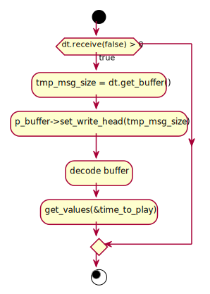

# Documentation for SoundZone Protocol
<!--
To compile puml use: (Assuming plantuml you are in the directory)
plantuml.jar -tsvg README.md -o sequence_diagrams
-->

version = 0.2.0

This file will document SZP.

As it is a 7th layer protocol, it is treated as a Point-Point communication

| Defines | Values |
|---|---|
| IPv | IPv4 |
| Transport protocol | UDP |
| Port | 1695 ( Seemingly not used ) |
| Endianess | Big-endian |
| Max length of msg | 1024 bytes |

## Dependencies
| Dependency version | Version number |
|---|---|
|DataTransport|0.3.0|

## Main Structure

[CID, {payload} ]

* CID - Command Id
* payload - Data to send (Structure depends on the CID)

## Data groups

### Time Encoding
[ us ]

| Byte| Range | Description | Symbol |
|---|---|---|---|
| 0-7 | [0-9.223.372.036.854.775.807] | Micro-second | us |

## Commands

### Command groups

| Range | Name |
|---| ---|
| 0x00 - 0x10 | Normal use |
| 0xF0 - 0xFF | Debugging |

### Command list

|CID | Name | Description |
|---|---|---|
| 0x01 | [send_sound_pack](#01---sendsoundpacket) | Send a payload to a client |
|||
| 0xF1 | [check_connnection](#f1---checkconnetion) | Used to check connection, used for debug |

---
---

## 01 - send_sound_packet
This command is used to send sound data to the client.

| Tag | Size [bytes] | Value | Description |
|---|---|---|---|
| cid | 1 | 0x01 | Command Id |
| time | 7 | - | Time to play the block of sound |
| payload | - | - | Payload |

<!--
```
@startuml 01_send
server -> client: [ cid, time, payload ]
@enduml
```
-->


---

## F1 - check_connection
Used the ckeck Connection on SZP level

| Tag | Size [bytes] | Value | Description |
|---|---|---|---|
| cid | 1 | 0xF1 | Command Id |
| ack | 1 | 0x01 | Acknolegment |

<!--
```
@startuml F1_check_con
server -> client: [ cid ]
group successful
    server <- client: [ cid, ack ]
end
@enduml
```
-->


---

## Class diagrams

### SZP

<!--
```
@startuml class_diagram

package soundzone_protocol {
    
    class SZP_master{
        --Private--
        - UDP_client dt
        - uint8_t comm_buffer[]
        ___
        --Public--
        + SZP_master()
        + SZP_master(char *, bool)
        + int check_connection()
        + int send_sound_packet(uint8_t *, uint16_t, long long int)
    }

    class SZP_slave{
        --Private--
        - UDP_server dt
        - char* fifo_name
        - uint8_t comm_buffer[]
        ___
        --Private--
        - int encode_and_send()
        - int react_on_incoming()
        --Public--
        + SZP_slave(char *)
        + ~SZP_slave()
        + int open_fifo()
        + int recieve()
        + int get_time(long long int *)
        }

    package szp {
        
        class soundzone_protocol {
            --Protected--
            # buffer_t* p_buffer
            # supported_cid_t cid
            # xF1_check_connection* check_connection
            # x01_send_sound_packet* send_sound_packet
            ___
            --Private--
            - static supported_cid_t initial_decode(uint8_t)
            --Protected--
            # uint16_t encode_and_send()
            --Public--
            + soundzone_protocol()
            + soundzone_protocol(uint8_t *, uint16_t)
            + int set_fifo(int *)
            + int set_values(uint8_t)
            + int set_values(uint8_t *, uint16_t)
            + int get_values(long long int *)
            + buffer_t* encode(buffer_t *)
            + int decode(buffer_t *)
        }

        class x01_send_sound_packet {
            --Private--
            - uint8_t* p_payload
            - uint16_t payload_size
            - int fifo_fd
            - long long int time
            ___
            --Public--
            + x01_send_sound_packet()
            + int set_fifo(const int *)
            + int set_values(long long int)
            + int set_values(uint8_t *, uint16_t)
            + int get_values(long long int *)
            + buffer_t* encode(buffer_t *)
            + void decode(buffer_t *)
            + int reset()
        }

        class xF1_check_connection {
            --Private--
            - uint8_t acknowledgment
            ___
            --Public--
            + xF1_check_connection()
            + int set_values(uint8_t)
            + int reset()
            + buffer_t* encode(buffer_t *)
            + int decode(buffer_t *)
        }
    

        package szp_custom_types{
        }
    }
}

SZP_master --o soundzone_protocol
SZP_slave --o soundzone_protocol

soundzone_protocol --* x01_send_sound_packet
soundzone_protocol --* xF1_check_connection
soundzone_protocol --* szp_custom_types

package DataTransport{
    SZP_master --* UDP_client
    SZP_slave --* UDP_server

    class UDP_client{}
    class UDP_server{}
}


@enduml
```
-->


### SZP_custom_types

<!--
```
@startuml class_diagram_custom_types

package szp_custom_types{
        
        enum supported_cid_t{
            cid_send_sound_packet = 1
            cid_enroll = 161
            cid_set_sound_format = 179
            cid_check_connection = 241
            cid_notSet = 255
        }

        class buffer_t{
            --Private--
            - uint8_t* p_buffer
            - uint16_t buffer_size
            - uint16_t write_head
            - uint16_t read_head
            --Public--
            + buffer_t(uint8_t *, uint16_t)
            + int append(uint8_t)
            + int append(const uint8_t *, uint16_t)
            + int read_byte(uint8_t *)
            + int get_buffer_rest(uint8_t **, uint16_t *)
            + int reset()
            + int set_write_head(uint16_t)
            + uint16_t get_write_head()
            + int print_buffer()
        }
    }

@enduml
```
-->


### SZP_slave flowchart

<!--
```
@startuml flow_szp_slave

start
if (dt.receive(false) > 0) then (true)
    :tmp_msg_size = dt.get_buffer();
    :p_buffer->set_write_head(tmp_msg_size);
    :decode buffer;
    :get_values(&time_to_play);
endif

stop

@enduml
```
-->


