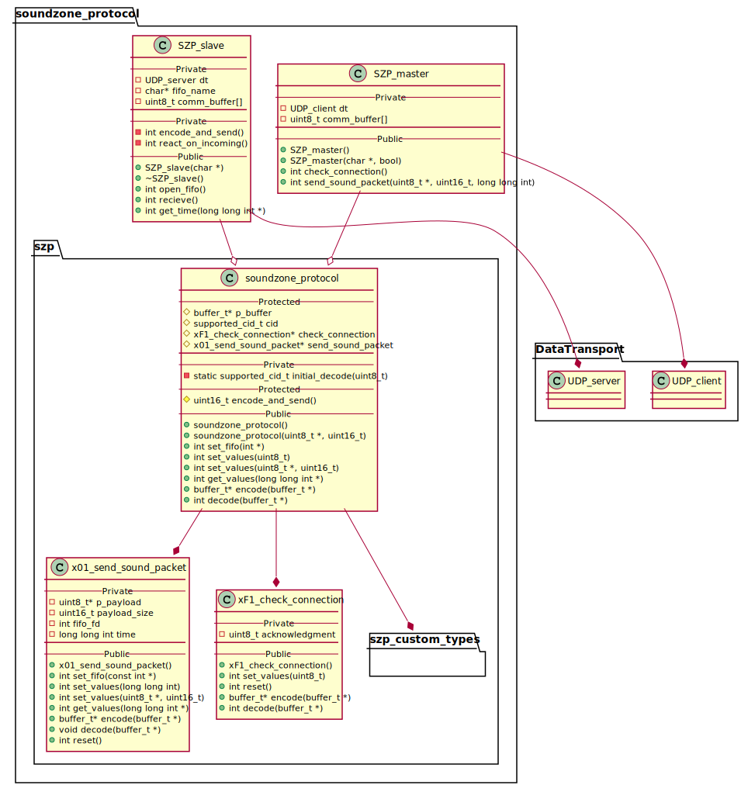

# Documentation for SoundZone Protocol
<!--
To compile puml use: (Assuming plantuml you are in the directory)
plantuml.jar -tsvg README.md -o sequence_diagrams
-->

version = 0.1.0

This file will document SZP.

As it is a 7th layer protocol, it is treated as a Point-Point communication

| Defines | Values |
|---|---|
| IPv | IPv4 |
| Transport protocol | UDP |
| Port | 1695 ( Seemingly not used ) |
| Endianess | Big-endian |
| Max length of msg | 1028 bytes |

## Dependencies
| Dependency version | Version number |
|---|---|
|DataTransport|0.3.0|

## Main Structure

[CID, {payload} ]

* CID - Command Id
* payload - Data to send (Structure depends on the CID)

## Data groups

### Time Encoding
[ us ]

| Byte| Range | Description | Symbol |
|---|---|---|---|
| 0-7 | [0-9.223.372.036.854.775.807] | Micro-second | us |

## Commands

### Command groups

| Range | Name |
|---| ---|
| 0x00 - 0x10 | Normal use |
| 0xF0 - 0xFF | Debugging |

### Command list

|CID | Name | Description |
|---|---|---|
| 0x01 | [send_sound_pack](#01---sendsoundpacket) | Send a payload to a client |
|||
| 0xF1 | [check_connnection](#f1---checkconnetion) | Used to check connection, used for debug |

---
---

## 01 - send_sound_packet
This command is used to send sound data to the client.

| Tag | Size [bytes] | Value | Description |
|---|---|---|---|
| cid | 1 | 0x01 | Command Id |
| time | 7 | - | Time to play the block of sound |
| payload | - | - | Payload |

<!--
```
@startuml 01_send
server -> client: [ cid, time, payload ]
@enduml
```
-->


---

## F1 - check_connection
Used the ckeck Connection on SZP level

| Tag | Size [bytes] | Value | Description |
|---|---|---|---|
| cid | 1 | 0xF1 | Command Id |
| ack | 1 | 0x01 | Acknolegment |

<!--
```
@startuml F1_check_con
server -> client: [ cid ]
group successful
    server <- client: [ cid, ack ]
end
@enduml
```
-->


---

## Class diagrams

### SZP

<!--
```
@startuml class_diagram

package SZP {
    SZP_master --o sound_zone_protocol
    SZP_slave --o sound_zone_protocol

    package sound_zone_protocol {
    sound_zone_protocol --* x01_send_sound_packet
    sound_zone_protocol --* xF1_check_connection
    sound_zone_protocol --* szp_custom_types

    package szp_custom_types{
        enum supported_cid_t{}
        class buffer_t{}
    }
    }
}

package DataTransport{
    SZP_master --* UDP_client
    SZP_slave --* UDP_server

    class UDP_client{}
    class UDP_server{}
}

class SZP_master{
    --Private--
    - UDP_client dt
    - uint8_t comm_buffer[]
    ___
    --Public--
    + SZP_master()
    + SZP_master(char *host, bool is_ip)
    + int check_connection()
    + int send_sound_packet(uint8_t* buffer, uint16_t packet_size)
}

class SZP_slave{
    --Private--
    - UDP_server dt
    - char* fifo_name
    - uint8_t comm_buffer[]
    ___
    --Private--
    - int encode_and_send()
    - int react_on_incoming()
    --Public--
    + SZP_slave(char* fifo_name)
    + ~SZP_slave()
    + int open_fifo()
    + int recieve()
}

class sound_zone_protocol {
    --Protected--
    # buffer_t* p_buffer
    # supported_cid_t cid
    # xF1_check_connection* check_connection
    # x01_send_sound_packet* send_sound_packet
    ___
    --Private--
    - static supported_cid_t initial_decode(uint8_t cid)
    --Protected--
    # uint16_t encode_and_send()
    --Public--
    + sound_zone_protocol()
    + sound_zone_protocol(uint8_t* comm_buffer, uint16_t buffer_size)
    + int set_fifo(int* fifo_fd)
    + int set_values(uint8_t value)
    + int set_values(uint8_t *values, uint16_t size)
    + buffer_t* encode(buffer_t* encoded_msg)
    + int decode(buffer_t* msg_to_decode)
}

class x01_send_sound_packet {
    --Private--
    - uint8_t* p_payload
    - uint16_t payload_size
    - int fifo_fd
    - long long int time
    ___
    --Public--
    + x01_send_sound_packet()
    + int set_fifo(const int* fifo_fd)
    + int set_values(long long int value)
    + int set_values(uint8_t *values, uint16_t size)
    + buffer_t* encode(buffer_t* encoded_msg)
    + void decode(buffer_t* msg_to_decode)
    + int reset()
}

class xF1_check_connection {
    --Private--
    - uint8_t acknowledgment
    ___
    --Public--
    + xF1_check_connection()
    + int set_values(uint8_t value)
    + int reset()
    + buffer_t* encode(buffer_t* encoded_msg)
    + int decode(buffer_t* buffer)
}

@enduml
```
-->




### SZP_custom_types

<!--
```
@startuml class_diagram_custom_types

package szp_custom_types{
        
        enum supported_cid_t{
            cid_send_sound_packet = 1
            cid_enroll = 161
            cid_set_sound_format = 179
            cid_check_connection = 241
            cid_notSet = 255
        }

        class buffer_t{
            --Private--
            - uint8_t* p_buffer
            - uint16_t buffer_size
            - uint16_t write_head
            - uint16_t read_head
            --Public--
            + buffer_t(uint8_t* buffer, uint16_t size)
            + int append(uint8_t byte)
            + int append(const uint8_t* buffer, uint16_t bytes_to_write)
            + int read_byte(uint8_t* byte)
            + int get_buffer_rest(uint8_t** buffer, uint16_t* size)
            + int reset()
            + int set_write_head(uint16_t head)
            + uint16_t get_write_head()
            + int print_buffer()
        }
    }

@enduml
```
-->


