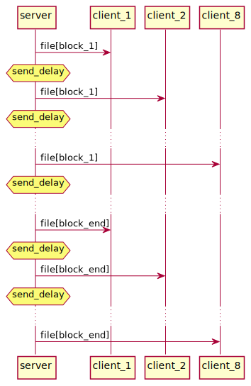

<!-- 
To compile puml use: (Assuming plantuml you are in the directory)
plantuml.jar -tsvg README.md -o diagrams
-->


# Test on the SoundZone-protocol package

## Todo
- [ ] Define file corruption

## What measurements are interesting

| Measurement | Description |
|---|---|
| Packet loss | How many packets are lost under transmission |
| File corruptness | How much of the file has been corrupted under transmission |
| Packet out of order | How many packets arrive out of order |
| Throughput | The time it takes to send all the data to all slaves |

### Test parameters to adjust

Below the parameters test that has been found relevant will be listed. 
These parameters will be adjusted different tests, in order to se their effect on 
the measurements.

| Test parameter | Abbreviation | Description |
|---|---|---|
| Send delay | send_delay | How much time passes between one transition has ended until the next begins |
| Block size | block_size | The size of the file block that is being transmitted. |

## Tests that will deliver the measurements

One test should be able to deliver both measurements.

1. Run prepare_measurements.py on your pc.
2. Start target "test_datatransport_slave" on all slaves
3. Configure the slave ip's in master_main.cpp.
4. Start target "test_datatransport_master" on the master
5. Run analyse_measurements.py on yout pc.

## Description of test

As it is wanted to find the effect of the test parameters on the measurements a few 
different iteration of the main test will be done. In order to detect packet out of order a test
file will be generated specifically for the block_size.

Main test:
1. Select the specific file for this iteration of the test.
2. Master starts timer (To measure throughput)
3. Send the file to the slaves following the sequence shown in the diagram below.
4. Slave saves file one block at the time.
5. Master ends timer after the last block is sent, and saves the result.

<!--
```
@startuml main_test_sequence
server -> client_1: file[block_1]
hnote over server : send_delay
server -> client_2: file[block_1]
hnote over server : send_delay
server -> client_N: file[block_1]
hnote over server : send_delay
...
server -> client_1: file[block_N]
hnote over server : send_delay
server -> client_2: file[block_N]
hnote over server : send_delay
server -> client_N: file[block_N]
@enduml
```
-->



## Test iterations

send_delay = [0, 20, 50, 70, 100, 130]
block_size = [4096, 2048, 1024, 512, 256, 128, 64]
test_iteration(send_delay, block_size)

| Iteration # | send_delay [us] | block_size [Bytes] |
|---|---|---|
|  | 0 | 4096 |
|  | 20 | 4096 |
|  | 50 | 4096 |
|  | 70 | 4096 |
|  | 100 | 4096 |
|  | 130 | 4096 |
|  | 0 | 2048 |
|  | 20 | 2048 |
|  | 50 | 2048 |
|  | 70 | 2048 |
|  | 100 | 2048 |
|  | 130 | 2048 |
|  | 0 | 1024 |
|  | 10 | 1024 |
|  | 50 | 1024 |
|  | 70 | 1024 |
|  | 100 | 1024 |
|  | 130 | 1024 |
|  | 0 | 512 |
|  | 10 | 512 |
|  | 50 | 512 |
|  | 70 | 512 |
|  | 100 | 512 |
|  | 130 | 512 |
|  | 0 | 256 |
|  | 10 | 256 |
|  | 50 | 256 |
|  | 70 | 256 |
|  | 100 | 256 |
|  | 130 | 256 |
|  | 0 | 128 |
|  | 10 | 128 |
|  | 50 | 128 |
|  | 70 | 128 |
|  | 100 | 128 |
|  | 130 | 128 |
|  | 0 | 64 |
|  | 10 | 64 |
|  | 50 | 64 |
|  | 70 | 64 |
|  | 100 | 64 |
|  | 130 | 64 |

## Dependencies
| Dependency version | Version number |
|---|---|
|SoundZoneProtocol|0.2.0|
